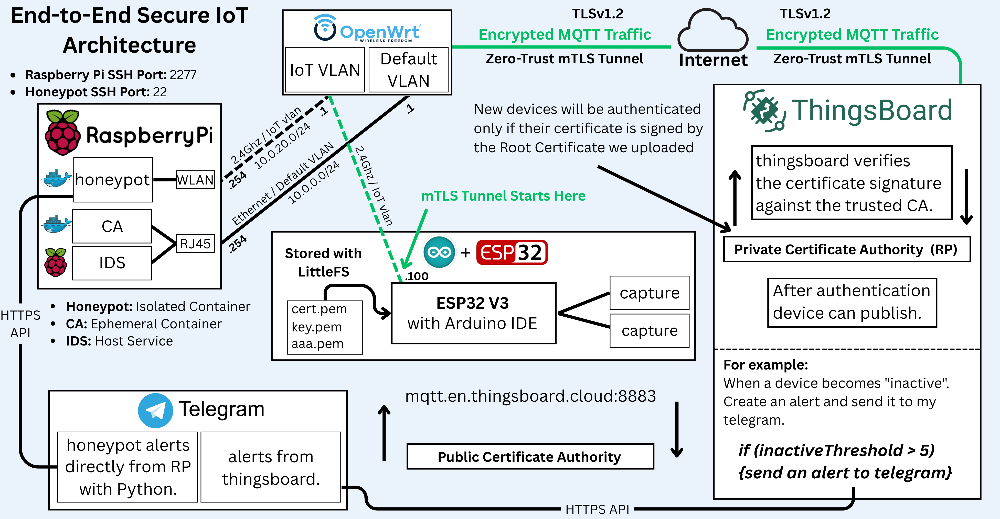

# Zero-Trust-IoT-lab-at-home

[](https://github.com/RadouaneElhajali/Zero-Trust-IoT-lab-at-home)
[](https://github.com/yourusername/zero-trust-iot-security)
[](https://github.com/yourusername/zero-trust-iot-security)


[View Full Project Report (PDF)](https://drive.google.com/file/d/1Hh-sv8bAHPXcVmj_s_4LRTFRRcF79WQb/view?usp=drive_link)** - Complete technical documentation

> A comprehensive, production-ready Zero-Trust security framework for IoT deployments featuring end-to-end encryption, certificate-based authentication, and real-time threat monitoring.

## Overview

This project implements a **complete Zero-Trust IoT security architecture** that addresses critical vulnerabilities in traditional IoT deployments. By combining network segmentation, mutual TLS authentication, honeypot detection, and intrusion detection systems, it provides enterprise-grade security using open-source technologies and commodity hardware.

### Key Features

- **End-to-End Security**: Complete mTLS implementation from ESP32 to cloud
- **Zero-Trust Architecture**: No implicit trust - every connection verified
- **Network Segmentation**: VLAN isolation for IoT devices
- **Honeypot Integration**: Cowrie SSH honeypot for threat detection
- **Real-time IDS**: Suricata-based intrusion detection
- **Private CA**: Custom certificate authority for device authentication
- **Instant Alerts**: Telegram integration for security notifications
- **Monitoring Dashboard**: Flask-based web interface for system monitoring
- **Cloud Integration**: Secure ThingsBoard platform connectivity

## Architecture



The system consists of four main layers:

1. **Network Infrastructure Layer** - OpenWrt router with VLAN segmentation
2. **Security Monitoring Layer** - Raspberry Pi hosting security services
3. **Certificate Authority Layer** - Private CA for device authentication
4. **IoT Device Layer** - ESP32 with secure communication capabilities

## Tech Stack

### Hardware
- **Router**: Xiaomi AX3000T (OpenWrt 24.10.0)
- **Security Hub**: Raspberry Pi 5 (8GB)
- **IoT Device**: ESP32-WROOM-32
- **Network**: CAT-6 Ethernet cables

### Software
- **Network OS**: OpenWrt 24.10.0
- **Container Platform**: Docker
- **IDS**: Suricata 6.0.10
- **Honeypot**: Cowrie
- **Certificate Management**: OpenSSL
- **IoT Platform**: ThingsBoard Community
- **Monitoring**: Flask + Python

## Prerequisites

- Xiaomi AX3000T router (or compatible OpenWrt device)
- Raspberry Pi 4/5 with 4GB+ RAM
- ESP32 development board
- Arduino IDE with ESP32 support
- Docker and Docker Compose
- Basic networking knowledge

## Quick Start

### 1. Network Setup
```bash
# Flash OpenWrt to router
# Configure VLANs (10.0.0.0/24 and 10.0.20.0/24)
# See docs/network-setup.md for detailed instructions
```
## 📚 Documentation
- [Download Full Report (PDF)](https://drive.google.com/file/d/1Hh-sv8bAHPXcVmj_s_4LRTFRRcF79WQb/view?usp=drive_link) - 58 pages, comprehensive documentation
- Report covers: Architecture, Implementation, Security Analysis, Performance Metrics

**STILL WORKING ON THIS REPO**
